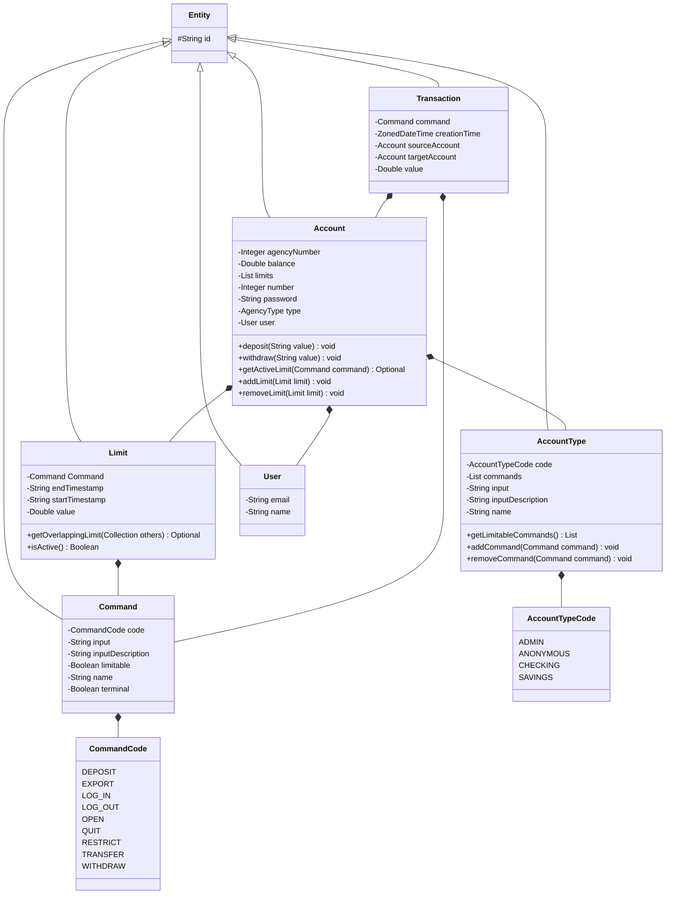
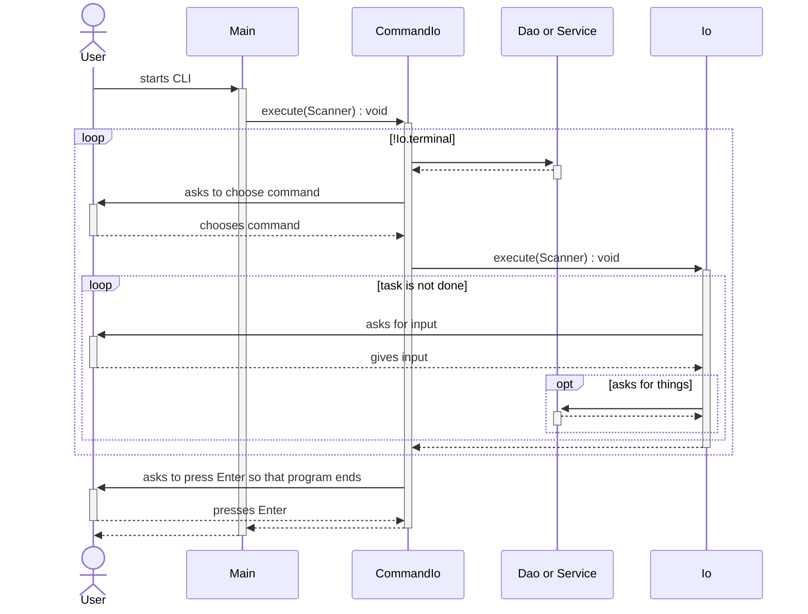

# About this project

This project is a delivery of an exercise related to a course on Java. It is a simple CLI bank application. The goal of
the exercise is to put into practice what has been learned in the course so far. Most of the decisions and
limitations of this project were driven by what the exercise asked for and the deadline.

# How to run it

Let's suppose you want to keep projects in ~/dev. First go to the folder.

```sh
cd ~/dev/
```

Then clone the repository.

```sh
git clone https://github.com/conrado-garcia-studies/dubidubibank.git
```

After that, go to src folder.

```sh
cd dubidubibank/src/
```

Next, compile the project.

```sh
javac @sources.txt
```

Finally, run the application.

```sh
java br.dubidubibank.application.Main
```

Or alternatively, after cloning the repository, you can open the project folder in IntelliJ IDEA, open the Main file and
click on the play icon to run the program. It is not the most interesting option, as the IntelliJ IDEA console does not
support screen clearing.

# How to test it

There is some initial and sample data when you start the CLI (an Anonymous Account is required for it to work, and you
need a non-Anonymous Account to log in).

You can log in with one of these Accounts:

| Agency | Account | Password | Type     | Balance   | Limits                                                                          |
|--------|---------|----------|----------|-----------|---------------------------------------------------------------------------------|
| 1      | 1       | admin    | Admin    | $3,454.46 | Deposit of $123.45 from 11:30 to 13:30, Transfer of $123.45 from 22:45 to 23:55 
| 8      | 4       | checking | Checking | $4,234.27 | Transfer of $1234.56 from 11:30 to 13:30, Withdraw of $1.23 from 22:45 to 23:55 
| 4      | 4       | savings  | Savings  | $1,054.32 | Withdraw of $12.34 from 11:30 to 13:30, Deposit of $12.34 from 22:45 to 23:55   

To simplify implementation, data is kept in memory and is not saved to disk or retrieved at startup. This is enough for
the delivery, as described in the exercise statement.

# How it works

The entities extend Entity class, so that all entities have the id attribute.

Account contains account information and is used to log in (hence the password field). SessionService is responsible for
logging into the Account. For simplicity, the password field is not encrypted and, when typing, the field is not
censored, which is enough for this exercise.

The Commands that the user can choose are in AccountType within Account. So different Commands are shown depending on
the AccountType. The Account with Anonymous AccountType has only Login and Quit Commands. Checking has access to almost
all Commands. Admin has the same access as Checking plus Open Command. Savings has access to some of the Commands.
Command has the terminate flag so that as soon as the Command finishes executing, the program also ends. The limitable
flag tells whether the Command can be used to set Limits. Each command has a CommandCode (enum), which is mapped to an
Io class in the commandCodeToIo bean. Io is responsible for executing the logic that interacts with the user. The input
field in the Command is the expected user input (e.g., "q" for Quit). The inputDescription gives the user a hint as to
what to type and what the command is about (e.g., "[Q]uit"). In Account there are analogous fields: accountTypeCode,
input and inputDescription.

Account also has a list of Limits. Within Limit there are methods to validate the Limit and ensure that there are no
overlapping Limits. When a Limit is added to an Account, the possibility of overlap is evaluated. Limit has a start and
end timestamps in the format HH:mm and also a Command and a value. To give an example of the meaning of the timestamps
in this project, for a Limit with startTimestamp equal to 13:43 and endTimestamp equal to 14:57, the Limit will be valid
from 13:43:00.0000 to 14:57:59.9999 (closed range) on the current day. Limits are evaluated in Io classes for the
Commands that have limitable equal to true. Restrict Command allows you to create, remove, and edit limits. Only the
field value is editable.

I guess that the exercise requires that the user cannot withdraw, deposit or transfer as many times as he/she wants.
So, to keep things simple, I restricted the system to one withdrawal per day, one deposit per day and one transfer per
day. Transactions are used to validate this scenario.

Transaction is a record of when a Command is executed. TransactionExportService uses Transactions to generate a file in
csv format and save it to a folder (as requested in the exercise). After the file is created, the file path is printed.



Getters, setters, and validation methods have been omitted from the diagram for easier visualization.



Main creates a Scanner and calls the CommandIo execute method passing the Scanner. CommandIo asks the user to choose
a Command. Then it calls the execute method of the Io which is mapped to the chosen Command. CommandIo does this until
it finishes executing a Command with terminal equal to true. Io is responsible for interacting with the user and
optionally calls Daos, Services and Utils. The Ios extend ScreenTemplateIo, which prints a header containing the name of
the bank and information about the session.

Usually when a command ends (either with success or error), the user has to press enter to continue. It may happen that
you have to press enter twice. Considering the deadline, I decided it was too risky to try to change this behavior.

You can find more information in the Javadocs.
