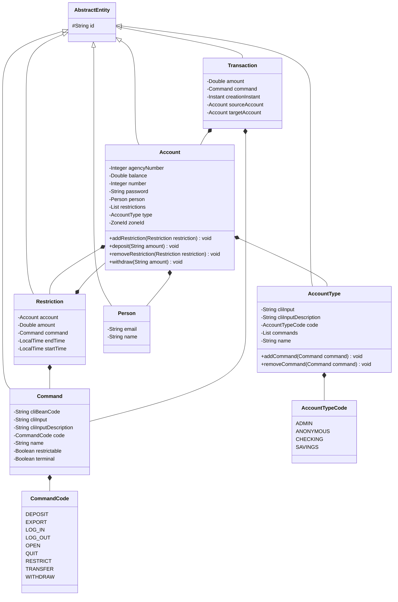
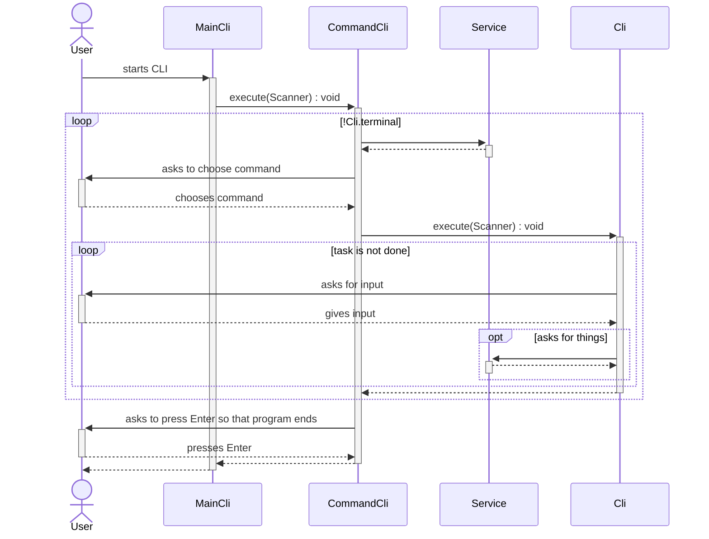

# About this project

This project is a delivery of an exercise related to a course on Java. For the first delivery, a simple CLI bank
application was implemented. The delivery of the second part is to expose the application through REST endpoints. The
goal of the exercise is to put into practice what has been learned in the course so far. Most of the decisions and
limitations of this project were driven by what the exercise asked for and the deadline (e.g. it still doesn't have
Javadocs and JUnit tests, which I would usually write).

# How to run it

## REST APIs

Go to the folder where you cloned the project. Example assuming you cloned from the ~/dev folder:

```sh
cd ~/dev/dubidubibank
```

Start the application.

```sh
./gradlew bootRun
```

## CLI

From the second delivery onwards, the CLI no longer works well through the terminal. The recommendation is to clone the
project, import it to IntelliJ IDEA (Gradle project option), install the Lombok plugin for IntelliJ IDEA, open the
application.properties file, change the value of the spring.profiles.active property to "cli", right click
DubidubibankApplication.java file and click the run option.

# How to test it

There is some initial and sample data when you start the application (an Anonymous Account is required for it to work,
and you need a non-Anonymous Account to log in).

You can log in with one of these Accounts:

| Agency | Account | Username | Password | Type     | Balance   | Commands                                                           | Restrictions                                                                    |
|--------|---------|----------|----------|----------|-----------|--------------------------------------------------------------------|---------------------------------------------------------------------------------|
| 1      | 1       | 1.1      | admin    | Admin    | $3,454.46 | Deposit, Export, Log out, Open, Quit, Restrict, Transfer, Withdraw | Deposit of $123.45 from 11:37 to 13:37, Transfer of $123.45 from 22:45 to 23:55 
| 8      | 4       | 8.4      | checking | Checking | $4,234.27 | Deposit, Export, Log out, Quit, Restrict, Transfer, Withdraw       | Transfer of $1234.56 from 11:30 to 13:30, Withdraw of $1.23 from 22:45 to 23:55 
| 4      | 4       | 4.4      | savings  | Savings  | $1,054.32 | Deposit, Log out, Quit, Restrict, Withdraw                         | Withdraw of $12.34 from 11:30 to 13:30, Deposit of $12.34 from 22:47 to 23:57   

The Swagger UI page is http://localhost:8080/swagger-ui/index.html. You can use http://localhost:8080/login
and http://localhost:8080/logout pages to switch users and test the APIs with specific users. Currently there is no
support for HTTPS. The login username is in the format "$agencyNumber.$accountNumber". For example, to log in to agency
8 and account 4, type "8.4" in the username field and "checking" in the password field and click the button to confirm.
The session duration is set to 30 minutes.

A common test path would be to log in as a user (e.g using "1.1" and "admin" for username and password, respectively),
go to Swagger UI, get the result of GET /accounts/current and, with the IDs provided in the response, test other APIs.

# How it works

The entities extend AbstractEntity class, so that all entities have the id attribute.

Account contains account information and is used to log in (hence the password field). SessionService is responsible for
logging into the Account. ZoneId defines the time zone of the user (e.g. America/Sao_Paulo).

The Commands that the users can choose are in AccountType within Account. So different Commands are shown depending on
the AccountType. The Account with Anonymous AccountType has only Log In and Quit Commands. Checking has access to almost
all Commands. Admin has the same access as Checking plus Open Command. Savings has access to some of the Commands.
Command has the terminate flag so that as soon as the Command finishes executing, the program also ends. The
restrictable flag tells whether the Command can be used to set Restrictions. Each command has a CommandCode (enum). The
cliBeanCode tells what is the bean that executes the command. Cli is responsible for executing the logic that interacts
with the user. The cliInput field in the Command is the expected user input (e.g., "q" for Quit). The
cliInputDescription gives the user a hint as to what to type and what the command is about (e.g., "[Q]uit"). A Command
represents a role. It is used to decide whether an Account has access to a resource.

In Account Type there are analogous fields: code, cliInput and cliInputDescription. Account also has a list of
Restrictions. There are annotations that validate Restrictions and ensure, for example, that there are no overlapping
Restrictions. Restriction has a start LocalTime, an end LocalTime, a Command and an amount. When a user types 13:43 for
the start and 14:57 for the end the times are saved as 13:43:00.000 and 14:57:59.999, respectively. Restriction
validations consider closed ranges. The Restrict Command provides a CRUD of Restrictions. Amount is the only editable
field.

When the user deposits, transfers or withdraws, a Transaction record is created. Transactions are used to check whether
the user has exceeded the limit for the day for Deposit, Transfer or Withdraw Commands. TransactionExportService uses
Transactions to generate a file in CSV format and save it to a folder (as requested in the exercise). After the file is
created, the file path is printed.

Getters, setters and security methods have been omitted from the diagram for easier visualization.



MainCli creates a Scanner and calls the CommandCli execute method passing the Scanner. CommandCli asks the person to
choose a Command. Then it calls the execute method of the Cli which is associated with the chosen Command. CommandCli
does this until it finishes executing a Command with terminal equal to true. Cli is responsible for interacting with the
user and optionally calls Services. The Clis extend TemplateCli, which prints a header containing the name of the bank
and information about the session.


